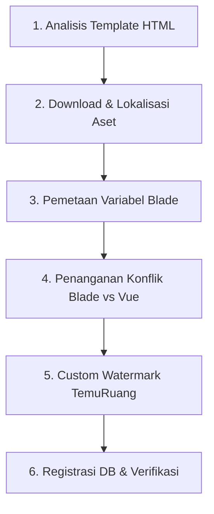

# Panduan Cloning & Lokalisasi Template Undangan (Blade V2)

Dokumen ini berisi panduan langkah-demi-langkah (*workflow*) untuk mengambil template HTML statis dari web luar (seperti Satu Momen) dan mengubahnya menjadi template Laravel Blade lokal yang dinamis, bersih dari branding luar, dan siap pakai di platform **TemuRuang**.

---

## Alur Kerja Utama



---

## Langkah 1: Analisis Template HTML Statis
1. Simpan file HTML statis (misal `Untitled-5.html`) ke folder target:
   `resources/views/templates/wedding/`
2. Buka file HTML tersebut, lalu identifikasi:
   * **Nama Tema/Folder Aset**: Lihat path latar belakang/ornamen (misal `/themes/islamic-wedding/`).
   * **Custom Fonts**: Cari tag `@import` font kustom (misal `/fonts/million_dreams/fonts.css` atau dari Google Fonts).
   * **Audio Pengiring**: Cari tag `<audio>` untuk mengetahui lagu latar belakang yang dipakai.

---

## Langkah 2: Download & Lokalisasi Aset
Aset eksternal dari domain asal (seperti `satumomen.com` atau `assets.satumomen.com`) **harus dipindahkan ke lokal** agar tidak bergantung pada koneksi/server eksternal dan mencegah kendala CORS.

### 1. Struktur Folder Target di `public/`
Pastikan Anda membuat folder penampung berikut sebelum mengunduh:
* **Tema Gambar & Ornamen**: `public/themes/{nama-tema}/`
* **Fonts**: `public/fonts/{nama-font}/`
* **Music**: `public/musics/`

### 2. Proses Download (Menggunakan cURL)
Gunakan perintah `curl` di terminal untuk mengunduh berkas aset satu per satu secara langsung:
```powershell
# Contoh download gambar tema
curl -o public/themes/islamic-wedding/bg.webp https://satumomen.com/themes/islamic-wedding/bg.webp
curl -o public/themes/islamic-wedding/left.webp https://satumomen.com/themes/islamic-wedding/left.webp

# Contoh download musik
curl -o public/musics/Murottal-SuratArRumAyat21.mp3 https://assets.satumomen.com/musics/Murottal-SuratArRumAyat21.mp3
```

### 3. Pembaruan Path Aset di Berkas Blade
Ubah semua tautan absolut eksternal di HTML menjadi path lokal root:
* `https://satumomen.com/themes/islamic-wedding/bg.webp` $\rightarrow$ `/themes/islamic-wedding/bg.webp`
* `https://assets.satumomen.com/musics/lagu.mp3` $\rightarrow$ `/musics/lagu.mp3`
* Tautan CSS utama (seperti `/build/assets/...`) pastikan diarahkan ke folder lokal di `public/build/assets/...`

---

## Langkah 3: Pemetaan Variabel Laravel Blade
Agar template dapat menampilkan data dinamis dari database, ganti teks statis dengan variabel Blade Laravel.

### 1. Blok PHP Inisialisasi (Letakkan di Paling Atas Berkas Blade)
Tambahkan blok inisialisasi default agar template dapat di-preview secara statis/langsung tanpa error:
```php
@php
    $couple = $couple ?? [
        'groom' => 'Arkan',
        'bride' => 'Nabila',
        'parents' => [
            'groom' => 'Bpk. Herman & Ibu Siti',
            'bride' => 'Bpk. Joko & Ibu Wati',
        ],
    ];

    $event = $event ?? [
        'date_iso' => '2026-12-12',
        'time' => '10:00',
        'location' => 'Grand Ballroom, Hotel Harmoni',
        'address' => 'Jl. Kebangsaan No. 45, Bandung',
        'maps_url' => 'https://maps.google.com/?q=Bandung',
    ];

    $schedule = $schedule ?? [
        ['title' => 'Akad Nikah', 'time' => '10:00 - 11:30', 'note' => 'Ruang Tulip'],
        ['title' => 'Resepsi Pernikahan', 'time' => '12:00 - 15:00', 'note' => 'Ballroom Utama'],
    ];

    $stories = $stories ?? [
        ['title' => 'Awal Bertemu', 'date' => 'Maret 2022', 'text' => 'Bermula dari perkenalan...'],
    ];

    $gallery = $gallery ?? [
        'https://images.unsplash.com/photo-1511285560929-80b456fea0bc?q=80&w=400',
    ];

    $bg = $bg ?? [
        'cover' => 'https://images.unsplash.com/photo-1519741497674-611481863552?q=80&w=800',
        'groom' => 'https://images.unsplash.com/photo-1507003211169-0a1dd7228f2d?q=80&w=400',
        'bride' => 'https://images.unsplash.com/photo-1544005313-94ddf0286df2?q=80&w=400',
    ];

    $eventDate = \Carbon\Carbon::parse($event['date_iso']);
    $dayName = $eventDate->translatedFormat('l');
    $dayNum = $eventDate->translatedFormat('d');
    $monthName = $eventDate->translatedFormat('F');
    $year = $eventDate->translatedFormat('Y');
@endphp
```

### 2. Ganti Elemen HTML Statis
* **Nama Mempelai**: `{{ $couple['groom'] }}` & `{{ $couple['bride'] }}`
* **Nama Orang Tua**: `{{ $couple['parents']['groom'] }}` & `{{ $couple['parents']['bride'] }}`
* **Tanggal & Waktu**: `{{ $eventDate->translatedFormat('d F Y') }}` atau `{{ $event['time'] }}`
* **Peta Denah & Link Maps**: `{{ $event['maps_url'] }}`
* **Target Hitung Mundur (Countdown)**: `data-datetime="{{ $event['date_iso'] }}T{{ $event['time'] }}"`
* **Identitas Tamu di QR & RSVP**:
  `data-guest="{{ request()->get('kpd', 'Tamu Undangan') }}"`

---

## Langkah 4: Penanganan Konflik Sintaksis Blade vs Vue
Satu Momen menyertakan aplikasi Vue client-side (`theme-app.js`) yang di-mount pada elemen `<main id="app">`. Vue akan mengompilasi semua elemen di dalamnya.

### Masalah Utama:
Jika ada penulisan `@{{ $variable }}` untuk menampilkan simbol `@` di depan teks (misal username Instagram), Blade akan mengabaikan kompilasi tersebut dan mengirimkan `{{ $variable }}` secara mentah ke browser. Vue akan mencoba mengompilasi `{{ $variable }}` tersebut, yang mengakibatkan crash karena variabel PHP tidak dikenali oleh Vue.

### Solusi Tepat:
Gunakan penggabungan string (concatenation) di PHP Blade agar teks di-render di server sebagai teks statis biasa sebelum sampai ke browser:
```html
<!-- SALAH (Akan membuat Vue crash di browser) -->
Join Live @{{ $couple['ig_groom'] ?? 'groom_ig' }}

<!-- BENAR (Aman & langsung tampil sebagai teks statis di browser) -->
Join Live {{ '@' . ($couple['ig_groom'] ?? 'groom_ig') }}
```

---

## Langkah 5: Custom Watermark TemuRuang
Untuk membersihkan sisa-sisa branding Satu Momen dan menerapkan branding platform Anda:

1. **Sembunyikan elemen watermark default** dengan CSS di dalam `<head>`:
   ```css
   /* Menyembunyikan watermark default & tombol order bawaan */
   .watermark-placeholder svg, 
   .watermark-placeholder img, 
   .watermark-placeholder a, 
   #waterMark,
   .btn-float.bg-success {
       display: none !important;
   }
   ```

2. **Tampilkan watermark TemuRuang** di kelas placeholder yang sama:
   ```css
   .watermark-placeholder::after {
       content: "TemuRuang";
       font-family: 'Cinzel', serif; /* Sesuaikan dengan font elegan tema */
       font-weight: bold;
       font-size: 14px;
       color: #3b1b12; /* Sesuaikan dengan warna primer tema (--inv-base) */
       opacity: 0.8;
       display: block;
       text-align: center;
       margin-top: 15px;
       letter-spacing: 1px;
   }
   ```

---

## Langkah 6: Registrasi Database & Verifikasi Akhir
1. **Verifikasi Sintaksis (PHP Lint)**:
   Jalankan ini di terminal untuk memastikan tidak ada kesalahan tag PHP/Blade yang menggantung:
   ```powershell
   php -l resources/views/templates/wedding/wedding-07.blade.php
   ```
2. **Daftarkan Slug ke Database**:
   Pastikan record template ditambahkan ke tabel `templates` dengan slug yang sesuai (misal `wedding-07`):
   ```sql
   INSERT INTO templates (name, slug, description, is_premium, is_active, event_type_id, created_at, updated_at)
   VALUES ('Wedding 07 (Islamic Syar\'i)', 'wedding-07', 'Tema undangan Syar\'i tanpa foto pra-nikah.', 1, 1, 1, NOW(), NOW());
   ```
3. **Uji di Browser**:
   Buka peramban di URL preview lokal untuk memastikan transisi *opening door*, audio, dan hitung mundur berjalan sempurna:
   `http://localhost:8000/preview/templates/wedding-07`
